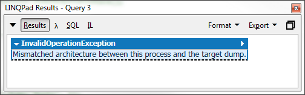
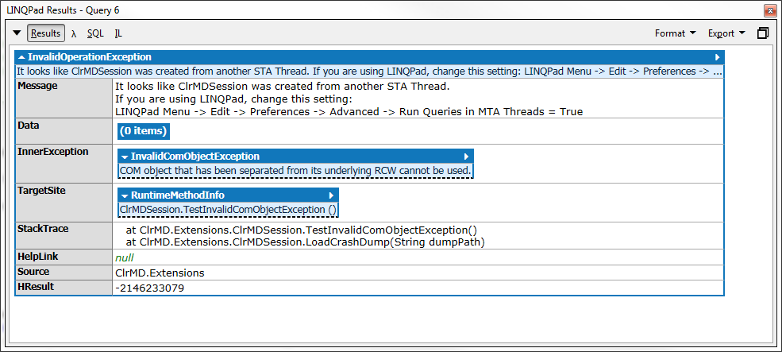

# Getting Started with ClrMD & LINQPad

[LINQPad](http://www.linqpad.net/) is an awesome tool created by Joe Albahari (writer of C# in a Nutshell).
It's free to use but I encourage you to buy a license for the autocompletion.

ClrMD combined with LINQPad does not totally replace a full blown memory profiler, but once you get started
I guarantee you will rarely open a classic memory profiler again. Investigating dumps and memory issue can be
a boring and tedious task, but now you can code your way to the solution!

## Install LINQPad (x86 & x64)

To open a dump with LINQPad, you must launch LINQPad in the same architecture (x86 or x64) as the machine that created the dump.

- [LINQPad (x86) Download](http://www.linqpad.net/GetFile.aspx?LINQPad5.zip)
- [LINQPad (x64) Download](http://www.linqpad.net/GetFile.aspx?LINQPad5-AnyCPU.zip)

If you don’t use the corresponding architecture, you will get this error:

## Add ClrMD references & namespaces

`ClrMD.Extensions` is now  available on nuget.org.

In "Query properties", add the nuget package
- ClrMD.Extensions

> Note: Adding nuget packages is not available in the free version of LinQPad. If purchasing a license is not an option you can download the package separately add the assemblies manually.

Include these namespaces in the “Additional Namespace Imports” tab:
- ClrMD.Extensions
- ClrMD.Extensions.LINQPad
- Microsoft.Diagnostics.Runtime

> Tip: In “Query Properties”, you can click “Set as default for new queries” to have ClrMD available by default.
> I personally choose to have one Query configured with ClrMD and clone the query (Ctrl+Shift+C) when I want to create another.

## Set up your template scripts (optional)

Most ClrMD investigation starts with either Threads or Heap info. I've built two template script that will give
you a summary with this information.

You can start with these scripts and 'Clone' (Ctrl+Shift+C) the query when you wan't to get more specific informations.

- [Dump template](../scripts/ClrMD_Dump.linq)
- [Live process template](../scripts/ClrMD_Live.linq)

## Change LINQPad settings to use MTA threads

> **This step is no longer required for LINQPad version 4.55.3 and up because the STA thread running
> the query is now reused.**

LINQPad launch each query execution in a new STA thread by default. Since ClrMD uses COM objects,
the ClrMDSession is created in a query execution and it will fail in a second query execution because
the COM objects will be accessed from another STA threads. The workaround I found is to configure
LINQPad to use MTA thread.

> LINQPad Menu -> Edit -> Preferences -> Advanced -> Run Queries in MTA Threads = True

This is the error you will get on the second query execution:

